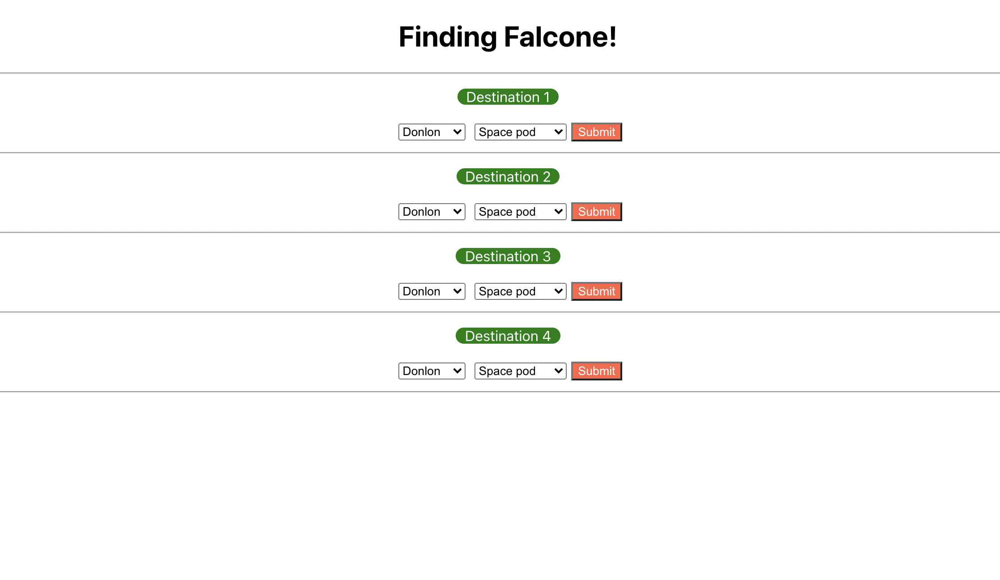
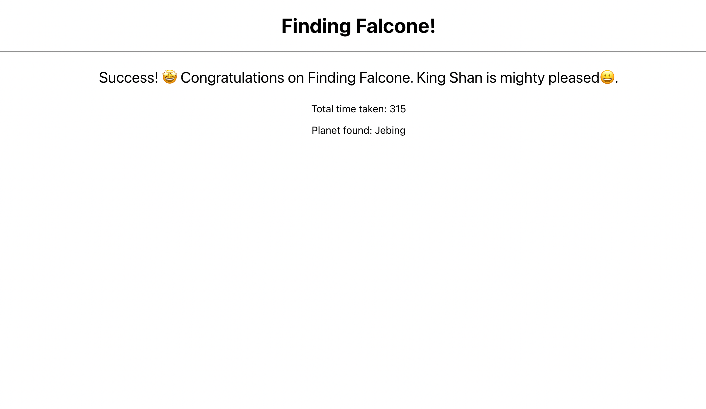

# Finding Falcon
Finding falcon challenge by Geektrust

## Table of contents

- [Overview](#overview)
  - [Available Scripts](#available-scripts)
- [Folder Structure](#folder-structure)
  - [Screenshot](#screenshot)
  - [Links](#links)
- [My process](#my-process)
  - [Built with](#built-with)
  - [What I learned](#what-i-learned)
  - [Useful resources](#useful-resources)
- [Acknowledgments](#acknowledgments)

## Available Scripts


## Overview

Our problem is set in the planet of Lengaburu...in the distant distant galaxy of Tara B. After the recent war with neighbouring planet Falicornia, King Shan has exiled the Queen of Falicornia for 15 years.
Queen Al Falcone is now in hiding. But if King Shan can find her before the years are up, she will be exiled for another 15 years....

### Available Scripts

In the project directory, you can run:

### `npm start`

Runs the app in the development mode.\
Open [http://localhost:3000](http://localhost:3000) to view it in the browser.

The page will reload if you make edits.\
You will also see any lint errors in the console.

### `npm test`

Launches the test runner in the interactive watch mode.\
See the section about [running tests](https://facebook.github.io/create-react-app/docs/running-tests) for more information.

## Folder Structure

    - src/components/main
            - DropDownList.js
            - Header.js
            - Footer.js
    - src/components/main/_test_   
            - - DropDownList.test.js     
    - src/components/secondary        
            - FindFalcon.js
            - NotFound.js
            - SuccessFound.js
    - src/components/secondary/_test 
            - FindFalcon.test.js
            - NotFound.test.js
            - SuccessFound.test.js         
    - src/constants
            - Constants.js    

### Screenshot

- Find Falcone 
  
- Result
  


### Links

- Live Site URL: [Live Website](https://kurosakicoder.github.io/ReactAlbums)

## My process

First, I used the Fetch API method to display the data on the front end. Then I used Bootstrap and Vanilla CSS to style the data.

### Built with

- JSX
- CSS
- ReactJS

### What I learned

I learnt how to manipulate react state values 

```js
// Function trigered when submit button is clicked
    const validateDistance = (e) => {
        e.preventDefault()
         // When submit button is clicked, we validate if vehicle max distance is greater than planet distance
        if(planets[planetIdx].distance <= vehicles[vehicleIdx].max_distance){
            // adding selected planets to the useState value selectPlanets
            let allSelectedPlanets = [...selectPlanets,planets[planetIdx].name]
            setSelectPlanets(allSelectedPlanets)
             // adding selected vehicles to the useState value selectVehicles
            let allSelectedVehicles = [...selectVehicles,vehicles[vehicleIdx].name]
            setSelectVehicles(allSelectedVehicles)
            // adding selected total time to the useState value totalTime
            // we also calculate the time taken by each vechicle by calculating distance/speed
            let allSelectedTime = totalTime + vehicles[vehicleIdx].max_distance/vehicles[vehicleIdx].speed;
            setTotalTime(allSelectedTime)

            // Adding the key add for those planets which has been selected
            // if the key add exists for the planet, the option for selecting this planets becomes disabled
            planets[planetIdx]['add'] = true
            let settingPlanetsAgain = [...planets]
            setPlanets(settingPlanetsAgain)
 
            if(vehicles[vehicleIdx].total_no > 1){
                // this condition is applied if there are more than one vehicle of the same type
                // we decrease the count of this vehicles by one
                vehicles[vehicleIdx].total_no -= 1  
                // Now we set the state of the vehicles to the new vehicles value   
                let settingVehiclesAgain = [...vehicles]
                setVehicles(settingVehiclesAgain)
            }
            else if(vehicles[vehicleIdx].total_no == 1){
                // This condition is applied if there is one vehicle of a particular type
                // Adding the key add for those vehicles which has been selected
                // if the key add exists for the vehcile, the option for selecting this vehicle becomes disabled
                vehicles[vehicleIdx]['add'] = true
                vehicles[vehicleIdx].total_no -= 1
                // Now we set the state of the vehicles to the new vehicles value 
                let settingVehiclesAgain = [...vehicles]
                setVehicles(settingVehiclesAgain)      
            }
        }        
    }
```

### Useful resources

- [UPDATE STATE CHANGE](https://stackoverflow.com/questions/55987953/how-do-i-update-states-onchange-in-an-array-of-object-in-react-hooks)

## Acknowledgments

I have done this project from scratch by referencing the websites that I mentioned.
